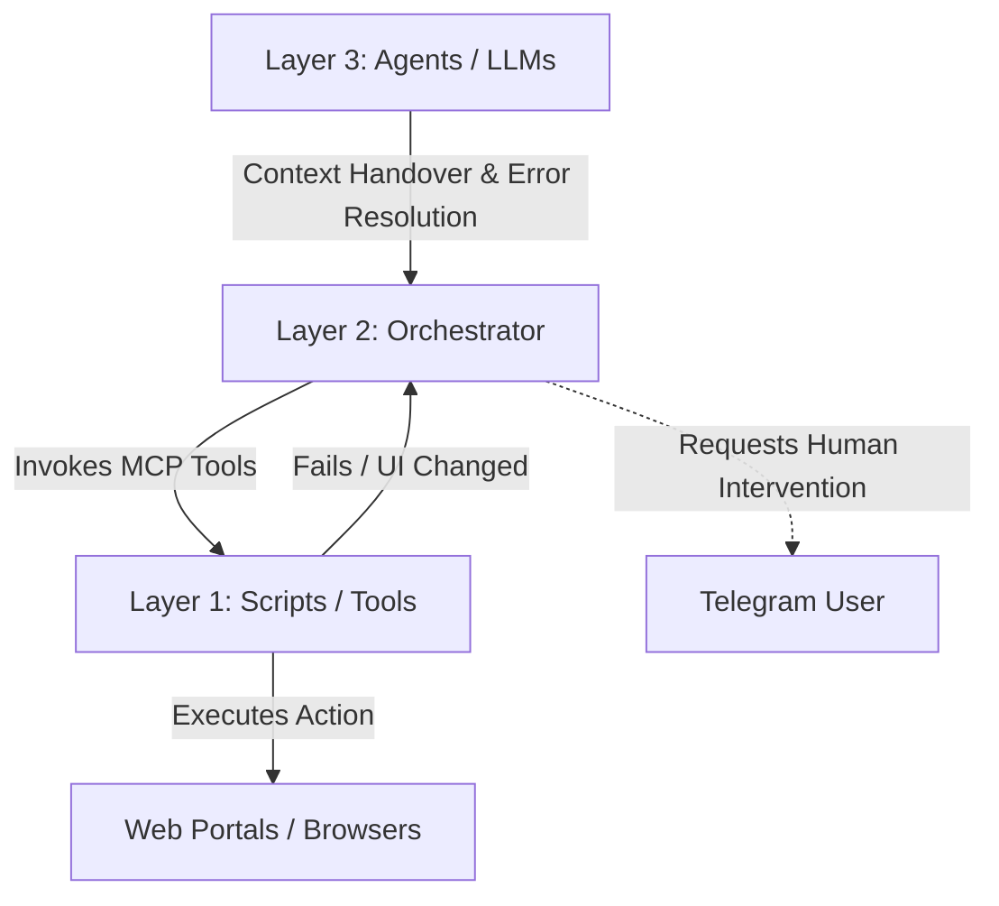
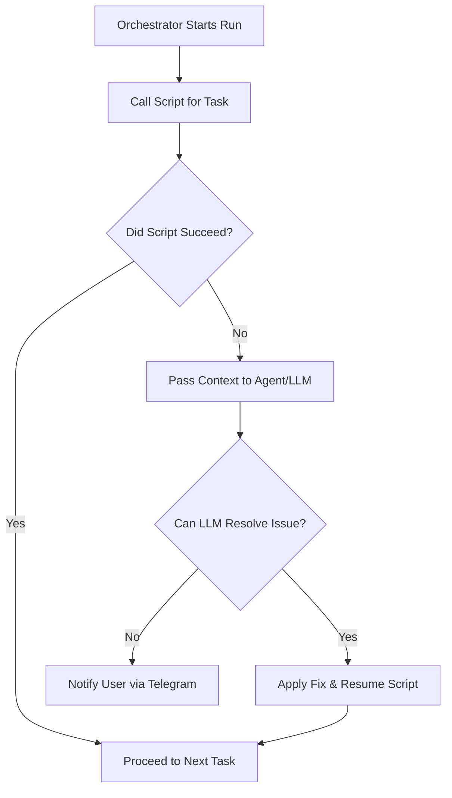

# Automated Job Search Agent

This project is designed to automate the job search process using a combination of scripted automation and agentic support from Large Language Models (LLMs). The goal is to create a resilient system that can handle the complexities of job hunting across various platforms, while eventually evolving into a centralized hub for executing any automated work on a local machine.

## Three-Layer Architecture

The system is built on a three-tier architecture to separate repetitive execution from logical coordination and high-level reasoning.



### 1. Tool Layer (Script-First)
The primary mode of operation is through well-defined Python scripts that handle specific, repetitive tasks like web scraping, logging in, and applying for jobs. These scripts are exposed as tools using the Model Context Protocol (MCP), making them accessible to terminal programs or LLM desktops.

### 2. Orchestrator Layer
The main orchestrator script handles the logical sequence of operations. It mostly uses the Tool Layer scripts to apply for jobs and perform routing. 

### 3. Agent Layer (LLM as a Fallback)
Agents/LLMs have access to the tools and the browser. When a script encounters an unexpected issue (e.g., a website layout change that breaks a scraper), the Orchestrator hands control over to an configured Agent (like Claude). The Agent attempts to dynamically solve the problem and then hands control back to the Orchestrator.

### Human in the Loop
If both the script and the LLM fail to resolve an issue, the agent will notify the user via a Telegram bot, allowing for manual intervention.

## Workflow Execution



## Project Goal

The main objective is to automate the entire job search workflow:

* **Job Scraping:** Automatically search for and collect job postings from various online portals.
* **Personalization:** Generate customized resumes, cover letters, and outreach messages for each application.
* **Application Submission:** Apply for jobs on different portals.
* **Networking:** Automate cold outreach and referral requests.

## Folder Structure

* `config/`: Contains configuration files, such as `requirements.txt`.
* `docker_files/`: Holds Docker-related files for containerization.
* `Instructions/`: Documentation for the project, including this `README.md`.
* `personal_details/`: Stores personal user information, such as `user_details.json` and `job_prefrences.json` (legacy - being phased out).
* `resumes/`: A directory for storing generated resumes.
* `scripts/`: Contains all the automation scripts.
    * `applying_to_portals/`: Scripts for applying to jobs on specific portals.
    * `common_stuff/`: Shared utilities and functions used across different scripts, including `vector_db_manager.py` for vector database operations.
    * `cookie_management_login/`: Scripts for managing logins and browser cookies.
    * `getting_referals/`: Scripts for automating referral requests.
    * `job_scraping/`: Scripts dedicated to scraping job postings.
    * `networking/`: Scripts for networking-related tasks.
    * `orchestrator/`: The main script that coordinates the execution of all other scripts.
    * `personalize_resume_coverletter_msg/`: Scripts that use LLMs to generate personalized content.
* `vector_db/`: Contains the vector database for embedded data used in Retrieval-Augmented Generation (RAG) to dynamically pull highly relevant personal context for forms and personalization, replacing static JSON files.

## How it Works

The `orchestrator` script is the entry point for the agent. It will coordinate the execution of the other scripts in the `scripts/` folder to perform the job search tasks in a logical sequence. Each script is designed to be modular and handle a specific part of the workflow.

## Setup

1. Install dependencies: `pip install -r config/requirements.txt`
2. Open `setup.html` in a browser and fill out your personal details and job preferences.
3. Save the generated Python script as `setup_data.py` in the project root.
4. Run `python setup_data.py` to insert your details into the vector database.

## Testing Naukri Auto-Apply (Phase 2+)

The project now includes comprehensive testing tools for the Naukri auto-apply workflow:

### Quick Test Commands

```bash
# Run end-to-end test (validates selectors & form detection)
python scripts/tests/naukri_e2e_test.py --max-jobs 3 --headed

# Test form filling with real job posting (dry-run)
python scripts/tests/test_real_job_posting.py --portal naukri \
  --url "https://www.naukri.com/jobs/..." --dry-run

# Full auto-apply via orchestrator menu
python scripts/orchestrator/orchestrator.py
# Select: 2 (Naukri) → 2 (Apply to jobs)
```

### Key Testing Files

- `scripts/tests/naukri_e2e_test.py` — End-to-end validation framework (3 stages)
- `scripts/common_stuff/naukri_selector_discovery.py` — Selector validation utility
- `scripts/common_stuff/retry_utils.py` — Retry logic with exponential backoff
- `Instructions/NAUKRI_SELECTOR_ANALYSIS.md` — Detailed selector audit
- `Instructions/NAUKRI_QUICK_REFERENCE.md` — Quick reference guide

### Enhancements Included

- **Multi-tier selector fallbacks** — Resilient to Naukri UI changes
- **Selector validation** — Real-time validation reports (JSON exports)
- **Retry logic** — Exponential backoff for transient failures
- **Better error handling** — Improved logging and diagnostics
- **Enhanced form validation** — Required field detection before submission
- **NLA popup handling** — Naukri-specific popup management

### Test Output

Tests generate diagnostic reports in `logs/` directory:
- `logs/naukri_selector_validation_*.json` — Selector health status
- `logs/naukri_e2e_test_*.json` — Full test results with stage breakdowns

## MCP Server Integration

## MCP Server Integration

The project includes a Model Context Protocol (MCP) server located at `scripts/orchestrator/mcp_server.py`. This exposes the core automation logic (such as checking LinkedIn login, applying to jobs, and scraping jobs) as tools that can be directly invoked by an LLM (like Claude Desktop).

To configure an MCP client to use this server, add the following to your client's configuration (updating the paths to match your local setup):

```json
{
  "mcpServers": {
    "linkedin-agent": {
      "command": "/path/to/your/project/.venv/bin/python",
      "args": [
        "/path/to/your/project/scripts/orchestrator/mcp_server.py"
      ]
    }
  }
}
```

## Future Extensions

* **Knowledge Base Transition:** Moving from static `user_details.json` to a Vector Database. This will allow the LLM to search for and retrieve the most relevant skills, experiences, and project details dynamically for complex application forms.
* **General Automation Hub:** Expanding the MCP tools in the `scripts/` directory to handle generic desktop workflows beyond job hunting, utilizing the exact same Orchestrator/Agent fallback pattern.