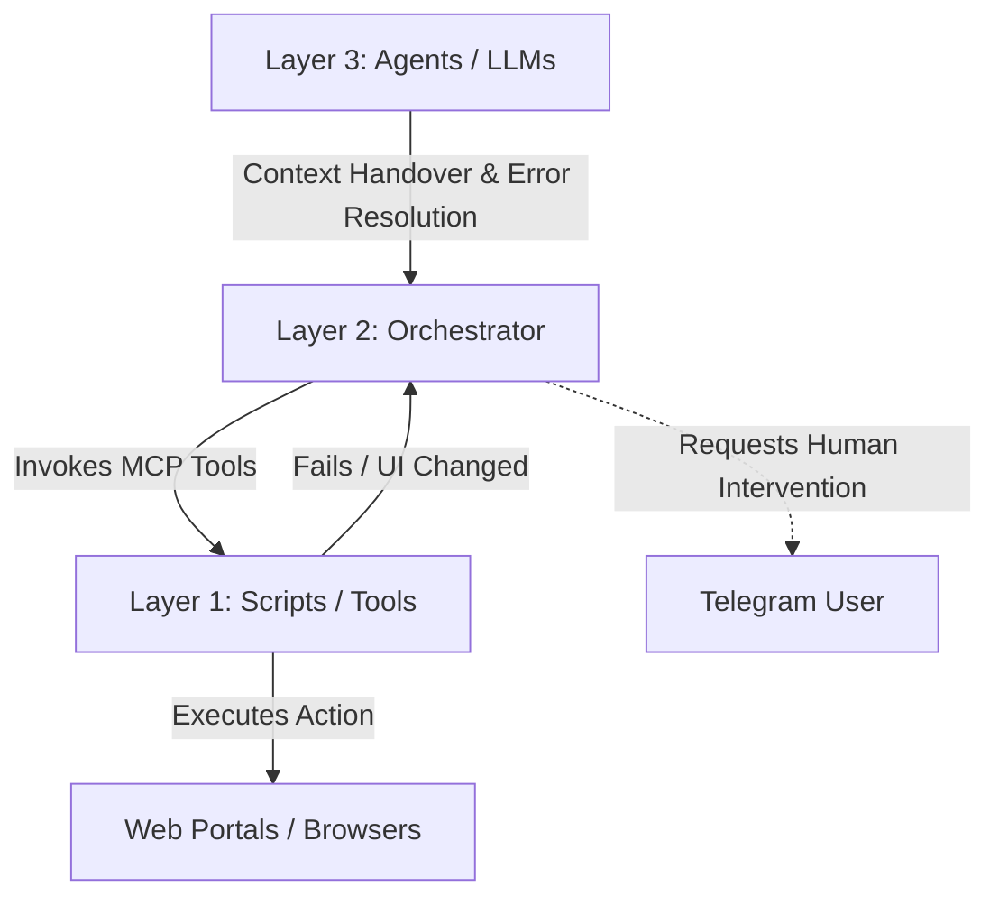
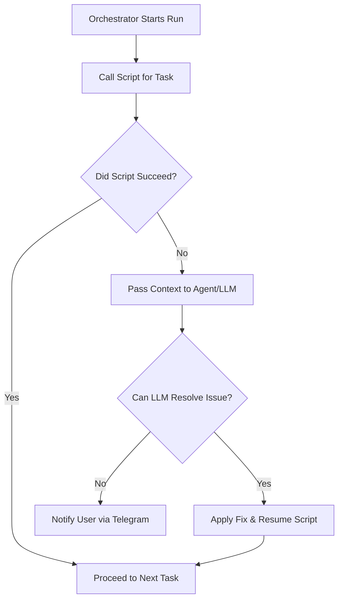

# Automated Job Search Agent

> **Recent update.** Added automatic daily resume re-uploading and 5-job batch processing for Naukri auto-applications.

This project automates the job search process using scripts and Large Language Models (LLMs). It handles job hunting across multiple platforms and will eventually run other automated tasks on a local machine.

## Three-layer architecture

The system uses a three-tier architecture. It separates repetitive tasks from logical coordination and high-level reasoning.


```mermaid
graph TD
    A[Layer 3: Agents / LLMs] -->|Context Handover & Error Resolution| B
    B[Layer 2: Orchestrator] -->|Invokes MCP Tools| C
    C[Layer 1: Scripts / Tools] -->|Executes Action| D[Web Portals / Browsers]
    C -->|Fails / UI Changed| B
    B -.->|Requests Human Intervention| E[Telegram User]
```

### 1. Tool layer

Python scripts handle web scraping, logging in, and applying for jobs. The system exposes these scripts as tools using the Model Context Protocol (MCP). This makes them accessible to terminal programs or LLM desktops.

### 2. Orchestrator layer

A central script sequences operations. It calls the tool layer scripts to apply for jobs and route data.

### 3. Agent layer

Agents have access to the tools and the browser. If a script fails, the orchestrator passes control to an agent like Claude. The agent tries to solve the problem and then hands control back.

### Human in the loop

If both the script and the agent fail, the system pings the user via a Telegram bot for manual intervention.

## Workflow execution


```mermaid
flowchart TD
    Start[Orchestrator Starts Run] --> RunScript[Call Script for Task]
    RunScript --> Check{Did Script Succeed?}
    Check -->|Yes| Next[Proceed to Next Task]
    Check -->|No| Agent[Pass Context to Agent/LLM]
    Agent --> Resolve{Can LLM Resolve Issue?}
    Resolve -->|Yes| ApplyFix[Apply Fix & Resume Script]
    ApplyFix --> Next
    Resolve -->|No| Human[Notify User via Telegram]
```

## Project goals

This project automates the entire job search workflow.

* **Job scraping.** Searches for and collects job postings from online portals.
* **Personalization.** Generates custom resumes, cover letters, and outreach messages for each application.
* **Application submission.** Applies for jobs on different portals.
* **Networking.** Automates cold outreach and referral requests.

## Obsidian knowledge graph navigation

- **[[PROJECT_MAP]]** Central knowledge graph index.
- **[[RESUME_TAILORING_ENGINE]]** Resume and cover letter engine, LLM integration, and Telegram bot.
- **[[ARCHITECTURE]]** Three-layer system design and failure escalation.
- **[[COMPONENTS]]** Master script and module inventory.
- **[[WORKFLOWS]]** Step-by-step execution flows.
- **[[REQUIREMENTS]]** Setup, dependencies, and environment configuration.
- **[[KNOWN_BUGS]]** Bug tracker and roadmap.

---

## Folder structure

* `config/` Configuration files like `requirements.txt`.
* `docker_files/` Docker container configurations.
* `Instructions/` Documentation.
* `personal_details/` Legacy user information.
* `resumes/` Generated resumes.
* `scripts/` Automation scripts.
    * `applying_to_portals/` Portal-specific application scripts.
    * `common_stuff/` Shared utilities and functions, including vector database operations.
    * `cookie_management_login/` Browser cookie and login managers.
    * `getting_referals/` Referral request automation.
    * `job_scraping/` Job posting scrapers.
    * `networking/` Networking tasks.
    * `orchestrator/` The main coordination script.
    * `personalize_resume_coverletter_msg/` LLM integration for custom content.
* `vector_db/` Vector database for embedded data. It replaces static JSON files and drives Retrieval-Augmented Generation (RAG) to pull relevant personal context for forms.

## How it works

The `orchestrator` script is the entry point. It coordinates the execution of the other scripts in the `scripts/` directory.

## Setup

1. Install dependencies: `pip install -r config/requirements.txt`
2. Open `setup.html` in a browser and enter your personal details and job preferences.
3. Save the generated Python script as `setup_data.py` in the project root.
4. Run `python setup_data.py` to insert your details into the vector database.

## Testing Naukri auto-apply

The project includes testing tools for the Naukri auto-apply workflow.

### Quick test commands

```bash
# Run end-to-end test
python scripts/tests/naukri_e2e_test.py --max-jobs 3 --headed

# Test form filling with real job posting
python scripts/tests/test_real_job_posting.py --portal naukri \
  --url "https://www.naukri.com/jobs/..." --dry-run

# Full auto-apply via orchestrator menu
python scripts/orchestrator/orchestrator.py
# Select: 2 (Naukri) → 2 (Apply to jobs)
```

### Key testing files

- `scripts/tests/naukri_e2e_test.py` End-to-end validation framework.
- `scripts/common_stuff/naukri_selector_discovery.py` Selector validation utility.
- `scripts/common_stuff/retry_utils.py` Retry logic with exponential backoff.
- `Instructions/NAUKRI_SELECTOR_ANALYSIS.md` Detailed selector audit.
- `Instructions/NAUKRI_QUICK_REFERENCE.md` Quick reference guide.

### Enhancements included

- **Multi-tier selector fallbacks.** Resilient to Naukri UI changes.
- **Selector validation.** Real-time validation reports in JSON.
- **Retry logic.** Exponential backoff for transient failures.
- **Better error handling.** Improved logging and diagnostics.
- **Enhanced form validation.** Required field detection before submission.
- **NLA popup handling.** Naukri-specific popup management.

### Test output

Tests generate diagnostic reports in the `logs/` directory.
- `logs/naukri_selector_validation_*.json` Selector health status.
- `logs/naukri_e2e_test_*.json` Full test results with stage breakdowns.

## MCP server integration

An MCP server at `scripts/orchestrator/mcp_server.py` exposes the core automation logic. LLMs like Claude Desktop can call these tools directly to check LinkedIn logins, apply to jobs, or scrape job postings.

To configure an MCP client, add this to your configuration and update the paths to match your local setup.

```json
{
  "mcpServers": {
    "linkedin-agent": {
      "command": "/path/to/your/project/.venv/bin/python",
      "args": [
        "/path/to/your/project/scripts/orchestrator/mcp_server.py"
      ]
    }
  }
}
```

## Future extensions

* **Knowledge base transition.** Moving from static JSON to a vector database. This lets the LLM search and retrieve the most relevant skills and projects dynamically.
* **General automation hub.** Expanding the MCP tools to handle generic desktop workflows. It will use the same orchestrator and agent fallback pattern.