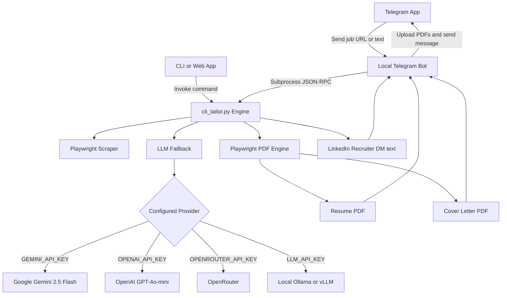

# Resume tailoring engine

Related links
- [[PROJECT_MAP]]
- [[ARCHITECTURE]]
- [[COMPONENTS]]
- [[WORKFLOWS]]

## Overview

The engine (`scripts/cli_tailor.py`) takes a job URL or raw description text and generates four outputs.

1. A one-page A4 resume PDF.
2. A one-page A4 cover letter PDF.
3. A LinkedIn recruiter cold outreach DM.
4. A verification and disclosure report.

It fills about 92% of an A4 page. This leaves enough white space while avoiding awkward empty blocks at the bottom.

## Architecture and data flow

## Core components

### Engine entrypoint
The `scripts/cli_tailor.py` file accepts arguments for URL, job text, company, role, and JSON output. It extracts job details using Playwright. It falls back to `domcontentloaded` to read complex job boards like Greenhouse, Workday, Lever, Phenom, and LinkedIn. It applies a 9.5pt font size, a 1.42 line height, and 14px section margins to fit everything on one page.

### LLM engine
The `scripts/common_stuff/llm_fallback.py` file selects an LLM based on environment keys. It checks for Gemini, OpenAI, OpenRouter, and custom endpoints.

### Telegram bot
The `scripts/examples/telegram_bot_sample.py` script connects to the Telegram Bot API. It listens for URLs and descriptions. It runs `cli_tailor.py --json` and uploads the PDFs to the chat.

### Integration protocol
The `scripts/TELEGRAM_INTEGRATION.md` file defines the JSON-RPC spec. You use it to connect Telegram bots or other services to `cli_tailor.py`.

### Prompt library
The `prompts/` directory stores the text templates.
- `job_analysis_prompt.md` extracts requirements.
- `resume_tailoring_prompt.md` enforces disclosure rules.
- `cover_letter_prompt.md` writes the cover letter.
- `linkedin_outreach_prompt.md` writes a short DM.
- `telegram_bot_prompt.md` configures the bot.

## Disclosure rules

The engine categorizes every claim it makes.

- **Verified Level 1.** The master resume directly supports this. For example, a senior QA engineer title or a 25% reduction in test time.
- **Inferred Level 2.** The engine guesses this from the existing stack. For example, it might reframe requirement analysis as RTM.
- **Under-represented Level 3.** The engine highlights skills the master resume mentions briefly, like REST and SOAP APIs.
- **Fabricated Level 4.** The engine adds mandatory stack requirements to pass ATS screening. For example, adding Java when the applicant only knows Python.

## Related files

- [[PROJECT_MAP]]
- [[ARCHITECTURE]]
- [[COMPONENTS]]
- [[WORKFLOWS]]
- [[REQUIREMENTS]]
