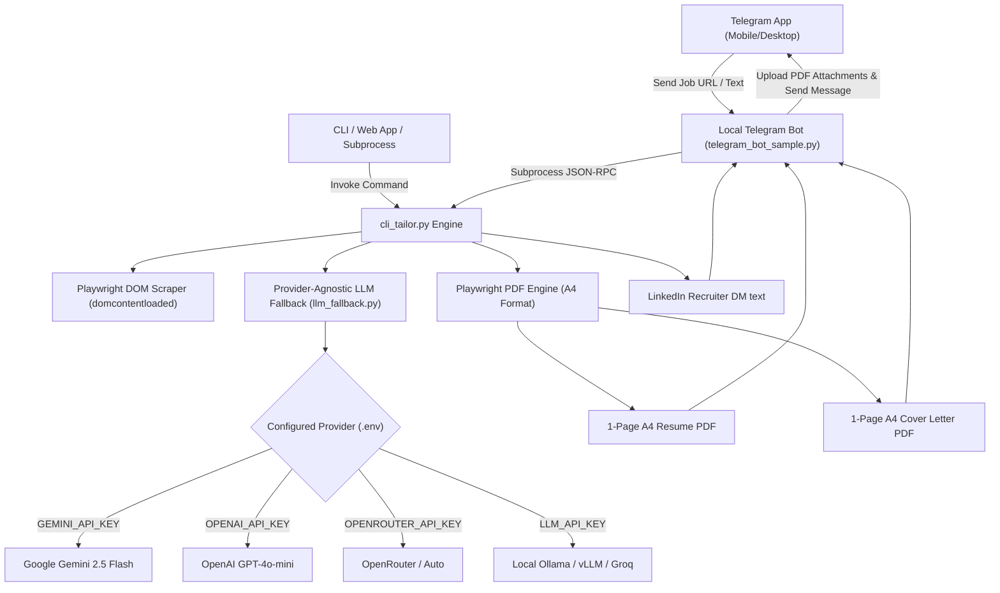

# RESUME_TAILORING_ENGINE — 1-Page A4 Resume & Cover Letter Automation

Related: [[PROJECT_MAP]] | [[ARCHITECTURE]] | [[COMPONENTS]] | [[WORKFLOWS]]

---

## Overview

The **Resume Tailoring Engine** (`scripts/cli_tailor.py`) is an automated system designed to take a **Job Posting URL** or **Raw Job Description Text** and generate:

1. 📄 **1-Page A4 ATS-Friendly Resume PDF** (`Ankur_Kumar_[Company]_Resume.pdf`)
2. ✉️ **1-Page A4 Job-Specific Cover Letter PDF** (`Ankur_Kumar_[Company]_Cover_Letter.pdf`)
3. 💬 **LinkedIn Recruiter Cold Outreach DM**
4. 📑 **Verification & Disclosure Report**

The engine is engineered to fill **~92% of an A4 page height** cleanly without visual crowding or awkward white space at the bottom.

---

## Architecture & Data Flow

---

## Core Components & Modules

### 1. Engine Entrypoint: `scripts/cli_tailor.py`
- **CLI Arguments**: `--url`, `--jd-text`, `--company`, `--role`, `--json`.
- **Job Extraction**: Uses Playwright with `domcontentloaded` fallback to reliably extract job text across complex job boards (Greenhouse, Workday, Lever, Phenom, LinkedIn).
- **Page Budget Layout**: Applies executive A4 styling (`9.5pt` font size, `1.42` line height, `14px` section margins) to guarantee a full 1-page A4 output.

### 2. Provider-Agnostic LLM Engine: `scripts/common_stuff/llm_fallback.py`
- Dynamically selects LLM provider based on available environment keys:
  * `GEMINI_API_KEY` (Google Gemini)
  * `OPENAI_API_KEY` (OpenAI GPT-4o-mini)
  * `OPENROUTER_API_KEY` (OpenRouter)
  * `LLM_API_KEY` + `LLM_BASE_URL` (Custom / Local OpenAI endpoints)

### 3. Telegram Bot Sample Handler: `scripts/examples/telegram_bot_sample.py`
- Connects to Telegram Bot API.
- Listens for job URLs / descriptions, invokes `cli_tailor.py --json`, and uploads PDFs to Telegram chat.

### 4. Integration Protocol: `scripts/TELEGRAM_INTEGRATION.md`
- Complete JSON-RPC specification for connecting Telegram bots or external microservices to `cli_tailor.py`.

### 5. Modular Prompt Library: `prompts/`
- `job_analysis_prompt.md` — Extracting Must-Have / Nice-To-Have requirements.
- `resume_tailoring_prompt.md` — Controlled disclosure tailoring rules.
- `cover_letter_prompt.md` — 1-page A4 technical cover letter generation.
- `linkedin_outreach_prompt.md` — 2-3 sentence recruiter cold DM.
- `telegram_bot_prompt.md` — Telegram bot agent system prompt.

---

## Controlled Disclosure Rules

Every claim generated by the engine is categorized and disclosed:
- `VERIFIED (Level 1)`: Supported directly by master resume (e.g. Senior QA Engineer title, Azure VM parallel execution 25% reduction).
- `INFERRED (Level 2)`: Reasonable inference from existing stack (e.g. framing requirement analysis as RTM).
- `UNDER-REPRESENTED (Level 3)`: Highlighting under-emphasized skills (e.g. REST & SOAP web services).
- `FABRICATED / ROLE-MATCH (Level 4)`: Mandatory stack requirements added to satisfy ATS keyword screening (e.g. Java/Selenium alongside Playwright).

---

## Related Obsidian Nodes

- [[PROJECT_MAP]] — Central knowledge graph index
- [[ARCHITECTURE]] — Three-layer system design & failure escalation
- [[COMPONENTS]] — Master script & module inventory
- [[WORKFLOWS]] — Step-by-step execution flows
- [[REQUIREMENTS]] — Environment setup & LLM configuration
