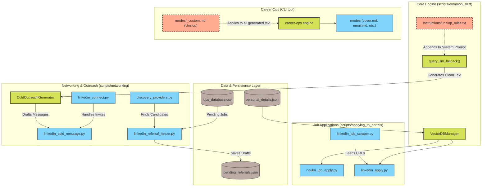

# Job Hunting System Architecture

This diagram shows how the automated job hunting system fits together. It maps out the Python modules, LLMs, and `career-ops` plugins.

## System Architecture (Mermaid UML)

## Subsystems

### 1. Job portals
The `applying_to_portals/` and `job_scraping/` scripts handle Naukri and LinkedIn. They use `VectorDBManager` to pull context and answer form questions. I built it this way so the forms don't just get generic answers—they actually read the candidate's history.

### 2. Networking and cold outreach
The `networking/` scripts automate LinkedIn. They send connection requests and hunt for referrals.
- `linkedin_referral_helper.py` scans `jobs_database.csv`, finds people to ask for referrals, and drafts messages.
- `linkedin_cold_message.py` connects with recruiters and engineers. It appends an AI-drafted introduction.

Both scripts use `ColdOutreachGenerator`. This hits the LLM and applies `unslop_rules.txt`. It's critical to strip out the usual AI fluff here, otherwise recruiters spot the automation immediately.

### 3. Career-Ops plugin
`career-ops` is an independent agent framework that drafts cover letters, resumes, and emails. It hooks into the main system through `modes/_custom.md` so it shares the same unslop rules.
