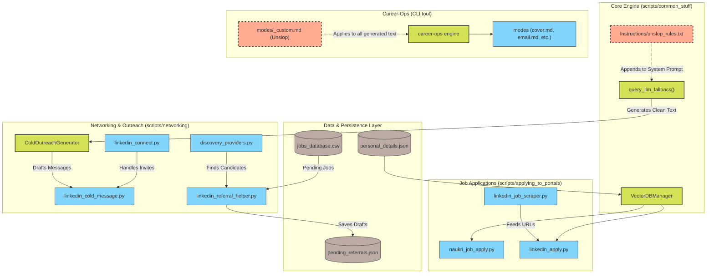

# Job Hunting System Architecture

This document contains the unified UML diagram for the automated job hunting system, detailing how the different Python modules, LLM integrations, and `career-ops` plugins interact.

## System Architecture (Mermaid UML)

## Subsystem Details

### 1. Job Portals Automation
Scripts in `applying_to_portals/` and `job_scraping/` handle the automated interaction with job boards like Naukri and LinkedIn. They pull candidate context from the `VectorDBManager` to dynamically answer form questions.

### 2. Networking and Cold Outreach
Scripts in `networking/` automate LinkedIn messaging, connection requests, and referral hunting.
- `linkedin_referral_helper.py`: Scans `jobs_database.csv`, discovers potential employees to ask for referrals, scores them, and drafts customized networking messages.
- `linkedin_cold_message.py`: Connects with recruiters and engineers, appending an AI-drafted introduction.
- Both rely heavily on `ColdOutreachGenerator`, which queries the LLM and strictly adheres to the `unslop_rules.txt` constraints to maintain a natural, human tone.

### 3. Career-Ops Plugin
The `career-ops` tool is an independent markdown-based agent framework that handles drafting cover letters, generating resumes, and writing emails. It has been integrated into the ecosystem by sharing the `unslop` principles via its local `modes/_custom.md` hook.
