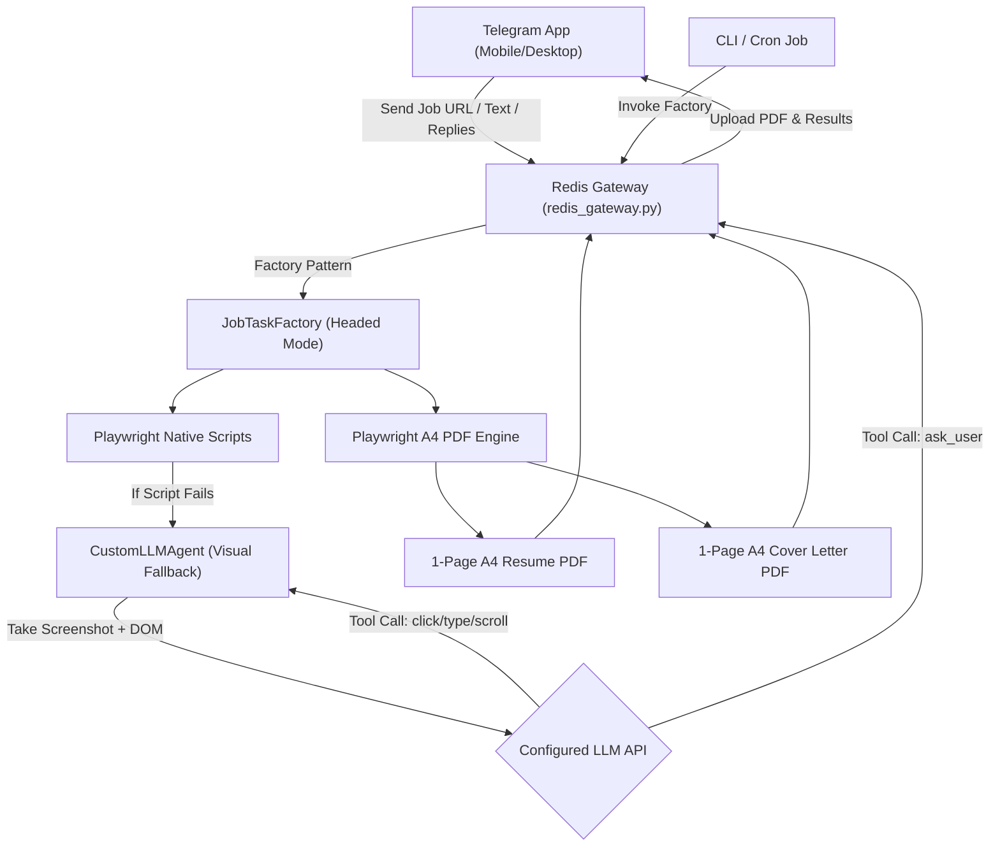

# Automated Job Search & Resume Tailoring Agent

A powerful engineering platform that automates **1-page A4 ATS-optimized resume tailoring, job-specific cover letters, recruiter outreach generation, and job portal application workflows**. 

Driven by a **provider-agnostic LLM engine** (Gemini, OpenAI, OpenRouter, Anthropic, or local OpenAI endpoints) and a **Playwright rendering pipeline**, it interfaces seamlessly with CLI tools, local Telegram bots, and web applications.

```
Job URL / JD Text ──► Scraper & LLM Analysis ──► Provider-Agnostic LLM Engine ──► Playwright PDF Renderer ──► 1-Page A4 Resume & Cover Letter + LinkedIn DM
```

---

## 🚀 Key Features

*   **Telegram-First Orchestration**: The entire application runs natively via a local Redis Gateway (`redis_gateway.py`), allowing you to instantly trigger and monitor job applications, resume tailors, and LLM conversations directly from your Telegram mobile app.
*   **1-Page A4 Executive Resume Engine**: Renders clean, ATS-compliant, single-page A4 PDFs that fill ~92% of page budget without overflow or awkward half-page whitespace.
*   **LLM API Function Calling (Visual Fallback Cascade)**: When standard Playwright scripts fail on a complex form, the system triggers `CustomLLMAgent`. This agent takes a screenshot, extracts the DOM interactables, and explicitly uses **Native LLM Tool Calling** (`click`, `type_text`, `scroll`, `ask_user`) to autonomously navigate the page.
*   **Provider-Agnostic LLM Core**: Supports Google Gemini, OpenAI, OpenRouter, Anthropic, or generic local/cloud endpoints.
*   **Human-In-The-Loop (`ask_user` tool)**: If the LLM gets stuck or encounters an unexpected 2FA request, it automatically pauses the browser and pushes a direct message to your Telegram asking for guidance before continuing.
*   **Automated Job URL Scraping**: Uses Playwright to reliably extract job postings across complex enterprise portals (Greenhouse, Workday, Lever, Phenom).

---

## 📊 Current Portal Status

| Portal | Auto-Apply | Job Scraping | Login / Cookie |
| :--- | :--- | :--- | :--- |
| **Naukri** | ✅ Works flawlessly end-to-end | ✅ Working | ✅ Working |
| **LinkedIn** | ⚠️ Partially Working | ❌ Broken (Anti-bot measures) | ✅ Working |
| **InstaHyre** | ❌ Not Implemented | ❌ Not Implemented | ❌ Not Implemented |

---

## 🤖 System Architecture




## ⚙️ Environment Configuration (`.env`)

Configure your preferred LLM provider in `.env`. The system is 100% provider-agnostic and will automatically select whichever API key is present:

```bash
# Option A: Google Gemini API (Recommended Free/Fast)
GEMINI_API_KEY=your_gemini_api_key_here
GEMINI_MODEL=gemini-2.5-flash

# Option B: OpenAI API
OPENAI_API_KEY=sk-proj-your_openai_api_key_here
OPENAI_MODEL=gpt-4o-mini

# Option C: OpenRouter API
OPENROUTER_API_KEY=sk-or-v1-your_openrouter_key_here
OPENROUTER_MODEL=openrouter/auto

# Option D: Generic OpenAI-Compatible Endpoint (Local Ollama, vLLM, DeepSeek, Groq, etc.)
LLM_API_KEY=your_local_or_custom_key
LLM_BASE_URL=http://localhost:11434/v1/chat/completions
LLM_MODEL=llama3
```

---

## 💻 CLI Usage (`cli_tailor.py`)

Run the automation tool directly from the terminal or call it via subprocess:

### 1. Tailor from Job Posting URL
```bash
python3 scripts/cli_tailor.py \
  --url "https://www.cohesity.com/careers/open-positions/?gh_jid=ddd581b5f17d1001ebb5bcba5f6c0000&type=wd" \
  --json
```

### 2. Tailor from Raw Job Description Text
```bash
python3 scripts/cli_tailor.py \
  --jd-text "We are hiring a Senior QA Engineer skilled in Java, Selenium, REST API testing, and Playwright..." \
  --json
```

---

## 📡 JSON-RPC & API Output Schema

When `--json` is supplied, `cli_tailor.py` returns structured JSON:

```json
{
  "status": "success",
  "company": "Cohesity",
  "role": "Senior Performance Engineer, Data Protection & Security Platform Engineering",
  "resume_pdf": "/path/to/resumes/tailored/Resume_Cohesity_SeniorPerformanceEngineer_20260809.pdf",
  "cover_letter_pdf": "/path/to/resumes/tailored/Cover_Letter_Cohesity_SeniorPerformanceEngineer_20260809.pdf",
  "linkedin_dm": "Hi! I noticed the open Senior Performance Engineer position at Cohesity and wanted to reach out. As a Senior QA Engineer specializing in Java/Selenium and Playwright test automation, I'd love to connect and share how my background fits your team's goals!"
}
```

---

## 📲 Telegram Bot Integration

The job hunt agent is natively integrated with the **[`my-personal-tg-bot`](file:///home/ankurkumar/ankur_code/my-personal-tg-bot)** Universal Multi-Agent Gateway.

Instead of running a standalone script, the agent runs via a robust `Procfile` deployment that handles Redis Pub/Sub orchestration.

### Quick Start (Production Mode)
```bash
# In the agent repository:
honcho start
```

### Interaction Flow:
1. `honcho` automatically spins up the local Redis server, the central `my-personal-tg-bot` gateway, and the `redis_gateway.py` worker process.
2. User sends a Job URL (e.g., `/job <url>`) to the Telegram Bot.
3. The central gateway routes the intent via a secure `MessageEnvelope` to the `agent.job-hunt.requests` Redis Stream.
4. `redis_gateway.py` detects the message, invokes the background CLI worker, and publishes the tailored resume PDF and LinkedIn DM back to `agent.job-hunt.responses`.
5. The bot delivers the tailored PDF and outreach text directly to your phone.

For more information, see the `my-personal-tg-bot` central gateway repository.

---

## 📚 Prompt Library Reference (`prompts/`)

The repository includes modular prompt markdown templates located in the `prompts/` directory:

| Prompt File | Description | Link |
|---|---|---|
| `job_analysis_prompt.md` | Extracts Must-Have, Nice-To-Have, and metadata from job text. | [`prompts/job_analysis_prompt.md`](file:///home/ankurkumar/ankur_code/agent/prompts/job_analysis_prompt.md) |
| `resume_tailoring_prompt.md` | System prompt & controlled disclosure rules for 1-page A4 resume tailoring. | [`prompts/resume_tailoring_prompt.md`](file:///home/ankurkumar/ankur_code/agent/prompts/resume_tailoring_prompt.md) |
| `cover_letter_prompt.md` | 1-page A4 technical cover letter generation prompt. | [`prompts/cover_letter_prompt.md`](file:///home/ankurkumar/ankur_code/agent/prompts/cover_letter_prompt.md) |
| `linkedin_outreach_prompt.md` | Concise 2-3 sentence recruiter cold outreach DM prompt. | [`prompts/linkedin_outreach_prompt.md`](file:///home/ankurkumar/ankur_code/agent/prompts/linkedin_outreach_prompt.md) |
| `telegram_bot_prompt.md` | System prompt and JSON-RPC protocol specs for Telegram Bot AI agents. | [`prompts/telegram_bot_prompt.md`](file:///home/ankurkumar/ankur_code/agent/prompts/telegram_bot_prompt.md) |

---

## 📄 License & Open-Source Security

* Personal sensitive details are maintained in `resumes/resume_master.md` and `.env` (ignored by `.gitignore`).
* Open-source template provided in `resumes/resume_master.example.md`.
