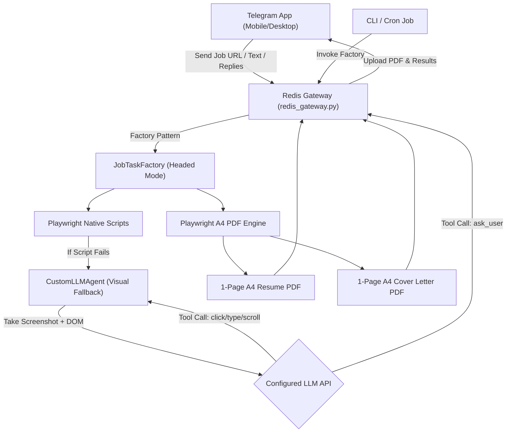

# Automated job search agent

This system automates the job hunt. It tailors a 1-page ATS-optimized resume, writes cover letters, drafts recruiter messages, and applies to jobs.

It uses a provider-agnostic LLM engine and Playwright. You can run it from the CLI or a Telegram bot.

```text
Job URL / JD Text ──► Scraper & LLM ──► LLM Engine ──► Playwright PDF Renderer ──► 1-Page Resume, Cover Letter, LinkedIn DM
```

## Features
- **Naukri auto-apply.** Automatically re-uploads resumes daily and processes applications in batches of five.
- **Telegram orchestration.** The whole app runs through a local Redis gateway (`redis_gateway.py`). You trigger workflows and get PDFs sent straight to your phone on Telegram.
- **PDF rendering.** It builds 1-page A4 resumes that fill exactly the right amount of space. No awkward half-page blanks.
- **Visual fallback.** When basic Playwright scripts fail on complex forms, `CustomLLMAgent` takes over. It takes screenshots and uses native LLM tool calling (`click`, `type_text`, `scroll`) to navigate the page.
- **Provider-agnostic.** Works with Gemini, OpenAI, OpenRouter, Anthropic, or local models.
- **Human-in-the-loop.** If the LLM gets stuck or hits a 2FA prompt, it pauses the browser and messages you on Telegram for help.
- **Scraping.** Extracts job postings from Greenhouse, Workday, Lever, and Phenom.

## Portal status

| Portal | Auto-Apply | Job Scraping | Login / Cookie |
| :--- | :--- | :--- | :--- |
| **Naukri** | ✅ Working | ✅ Working | ✅ Working |
| **LinkedIn** | ⚠️ Partial | ❌ Broken (Anti-bot) | ✅ Working |
| **InstaHyre** | ❌ Not built | ❌ Not built | ❌ Not built |

## Architecture



## Environment configuration (`.env`)

Set your LLM provider in `.env`. The system picks up whichever key is present.

```bash
# Option A: Google Gemini API
GEMINI_API_KEY=your_gemini_api_key_here
GEMINI_MODEL=gemini-3.6-flash

# Option B: OpenAI API
OPENAI_API_KEY=sk-proj-your_openai_api_key_here
OPENAI_MODEL=gpt-4o-mini

# Option C: OpenRouter API
OPENROUTER_API_KEY=sk-or-v1-your_openrouter_key_here
OPENROUTER_MODEL=openrouter/auto

# Option D: Local or custom endpoint
LLM_API_KEY=your_local_or_custom_key
LLM_BASE_URL=http://localhost:11434/v1/chat/completions
LLM_MODEL=llama3
```

## CLI usage (`cli_tailor.py`)

Run it from the terminal.

### 1. Tailor from a URL
```bash
python3 scripts/cli_tailor.py \
  --url "https://www.cohesity.com/careers/open-positions/?gh_jid=ddd581b5f17d1001ebb5bcba5f6c0000&type=wd" \
  --json
```

### 2. Tailor from raw text
```bash
python3 scripts/cli_tailor.py \
  --jd-text "We are hiring a Senior QA Engineer skilled in Java, Selenium, REST API testing, and Playwright..." \
  --json
```

## Output schema

When you pass `--json`, `cli_tailor.py` outputs this structure.

```json
{
  "status": "success",
  "company": "Cohesity",
  "role": "Senior Performance Engineer, Data Protection & Security Platform Engineering",
  "resume_pdf": "/path/to/resumes/tailored/Resume_Cohesity_SeniorPerformanceEngineer_20260809.pdf",
  "cover_letter_pdf": "/path/to/resumes/tailored/Cover_Letter_Cohesity_SeniorPerformanceEngineer_20260809.pdf",
  "linkedin_dm": "Hi! I noticed the open Senior Performance Engineer position at Cohesity and wanted to reach out. As a Senior QA Engineer specializing in Java/Selenium and Playwright test automation, I'd love to connect and share how my background fits your team's goals!"
}
```

## Telegram bot integration

The agent runs on the [`my-personal-tg-bot`](file:///home/ankurkumar/ankur_code/my-personal-tg-bot) gateway. 

Instead of a standalone script, it uses a `Procfile` deployment to handle Redis Pub/Sub.

### Quick start
```bash
# In the agent repository:
honcho start
```

### Interaction flow
1. `honcho` starts Redis, the central gateway, and the `redis_gateway.py` worker.
2. You send `/job <url>` to the bot.
3. The gateway routes the message to the `agent.job-hunt.requests` Redis stream.
4. `redis_gateway.py` picks it up, runs the worker, and pushes the PDFs to `agent.job-hunt.responses`.
5. The bot sends the files to your phone.

### Planned enhancements
Right now, manual runs via `orchestrator.py` or `cli_referral.py` only output to local JSON files. We need to build a Redis notifier component. This will publish task completions straight to the Redis stream. If the bot is offline, it will fail over to local logs. Check [`Instructions/ARCHITECTURE.md`](file:///home/ankurkumar/ankur_code/agent/Instructions/ARCHITECTURE.md) for details.

## Prompts library (`prompts/`)

The `prompts/` directory holds the markdown templates.

| Prompt File | Description | Link |
|---|---|---|
| `job_analysis_prompt.md` | Extracts required skills and metadata. | [`prompts/job_analysis_prompt.md`](file:///home/ankurkumar/ankur_code/agent/prompts/job_analysis_prompt.md) |
| `resume_tailoring_prompt.md` | Rules for tailoring a 1-page resume. | [`prompts/resume_tailoring_prompt.md`](file:///home/ankurkumar/ankur_code/agent/prompts/resume_tailoring_prompt.md) |
| `cover_letter_prompt.md` | Generates a 1-page technical cover letter. | [`prompts/cover_letter_prompt.md`](file:///home/ankurkumar/ankur_code/agent/prompts/cover_letter_prompt.md) |
| `linkedin_outreach_prompt.md` | Drafts a short cold DM for recruiters. | [`prompts/linkedin_outreach_prompt.md`](file:///home/ankurkumar/ankur_code/agent/prompts/linkedin_outreach_prompt.md) |
| `telegram_bot_prompt.md` | Protocol specs for Telegram AI agents. | [`prompts/telegram_bot_prompt.md`](file:///home/ankurkumar/ankur_code/agent/prompts/telegram_bot_prompt.md) |

## License and security

Keep personal details in `resumes/resume_master.md` and `.env`. The `.gitignore` prevents them from uploading. We included an open-source template at `resumes/resume_master.example.md`.
